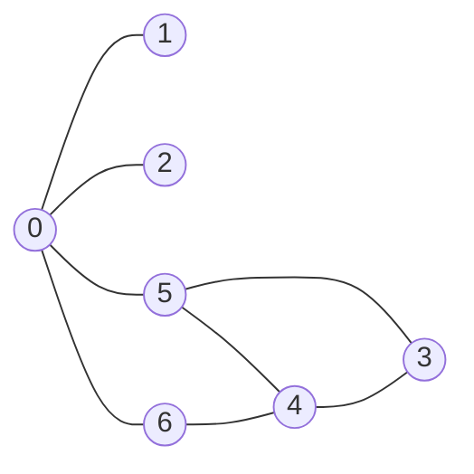

Graph Theory

Vertex(顶点)
Edge(边)

有向图
无向图


简单图

# 图的表示

	## 邻接矩阵

```graph
   1 2 3 4 
 1 0 0 0 0
 2 0 0 0 0
 3 0 0 0 0
 4 0 0 0 0
```

适合表示比较稠密的图


## 邻接表


1->

2->

3->

4->

存储空间比邻接矩阵少

适合比较稀疏的图


## 图的深度优先遍历




## 图的广度优先遍历

